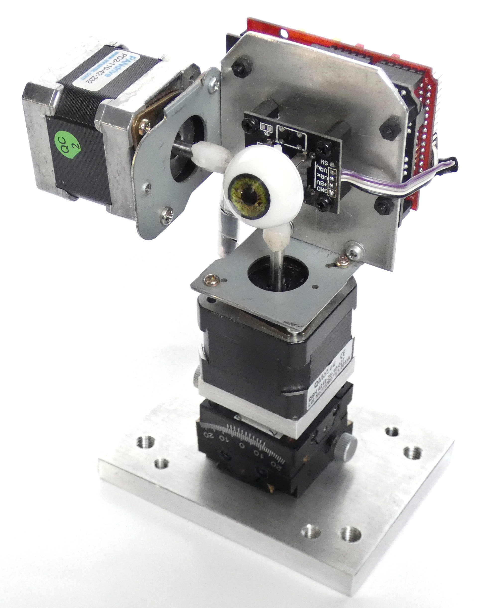
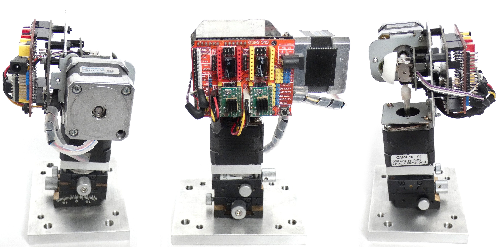
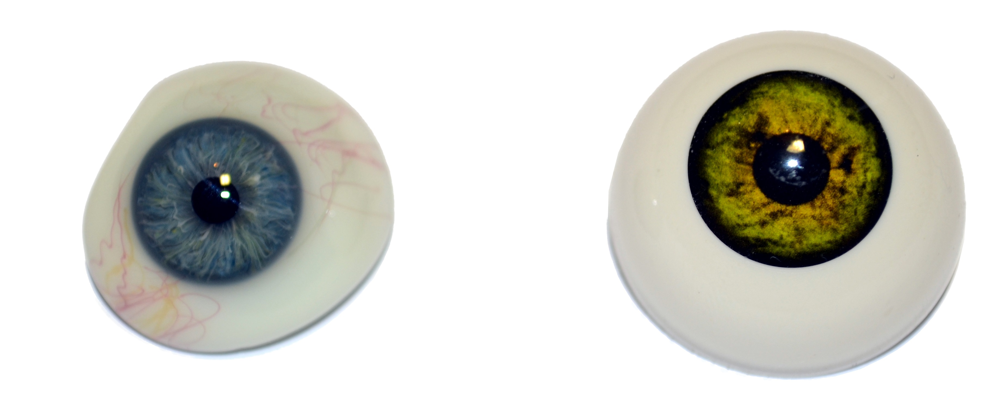
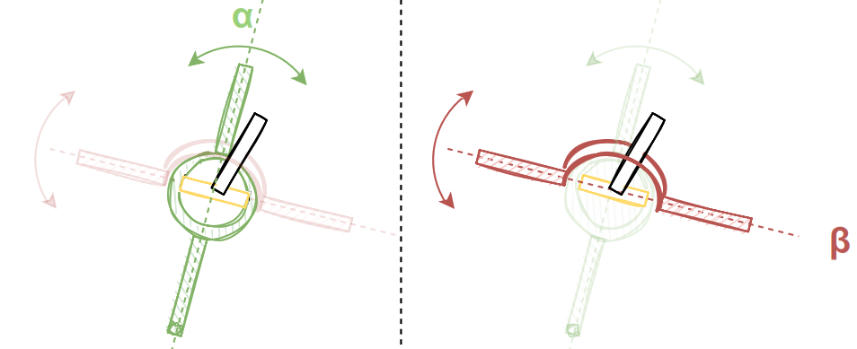
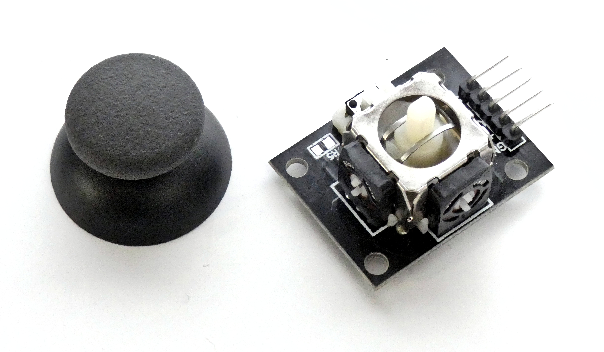

# RELAY: Robotic EyeLink AnalYsis

It is an artificial eye apparatus, capable of unrestricted movement in X and Y axis, and mimics the human eye for scientific purposes. So far, RELAY was used to evaluate EyeLink eye trackers and to calculate delay in tracking experiments.

This git is the software repository for the RELAY project. It also includes the hardware list necessary to build your own RELAY.

*If you find it useful, please quote the **RELAY Paper** 
(Paper in submission process, will be updated soon)*

The paper (Open Access) also contains the precision and accuracy results and long term exposure laser patterns. We also have an **OSF Repository** with additional results and pictures. 

## Platform

The device is based on Arduino UNO with a CNC shield and two stepper motor drivers:

The full Bill of Materials used:
- QSH-4218-41-10-027 Stepper motor from Trinamic
- QSH-4218-41-10-035 Stepper motor from Trinamic
- 2x Stepper Motor adapter plate
- 2x A4988 Stepper Driver from Pololu
- Arduino UNO
- Arduino CNC Shield (GRBL compatible)
- Arduino Thumb Joystick
- Grimas Eye Prop
- 8x Plastic Spacers and screws
- Aluminium sheet metal
- Aluminium baseplate
- 2x Optical tilting adapter
- 2x durable plastic for motor shaft-Joystick adapters

## Build

### Steppers
After building a first prototype with two RC servo motors (SG90, 9g weight, 0.3 seconds for 180°) it became necessary to switch to a build-up using stepper motors, as servos, while being fast enough, showed some wiggle and weren't precise enough ($\pm 1\degree$) in repeating the set angle as compared to the stepper motors, with a well-defined step. Henceforth, the two stepper motors were used.

The motors were driven by A4988 from Pololu, common stepper motor drivers, typically used in 3D Printing applications. The connection to the Arduino was done using an Arduino CNC expansion shield, which already had the fitting mounting adapter for the drivers. The electronics and motors were powered by 12 volts.

The used stepper motors, designed for large machinery, are largely over-dimensioned for the task of moving a lightweight eye construction, so that an overload of the motors and thus reaching the torque threshold, where steps would be lost, should not happen. Using the stepper motors in RELAY resulted in a smooth and quiet motion.

For adjustability purposes, the motor rig was mounted on two fine pitched tilting platforms, used in optical setups, in order to fine tune the apparatus and the initial angle of the eye.

The resulting mechatronic system has the addressable resolution of 1.8° at full step. The manufacturer of the motor states the positioning error lower than 5%, thus resulting in worse case max. $\pm 0.09°$ when stepping a full step at a time. In 16 micro-step mode, as used in RELAY apparatus, the drivers subdivide a full step to 16 micro-steps resulting in addressable 0.1125° per micro-step. Depending on the stepper driver, and the physical build of the motor, the resulting micro-steps can deviate from the ideal position, as the sinusoidal current, necessary for the intermediate position between the steps is only an estimation. This means that the resulting micro-steps, are not necessarily equidistant. The full and half-step positions, i.e. the initial, 8th and 16th position in a 16 micro-stepping sequence would still however be as precise as driven in full or half-step mode.

Practically, this results in a precision of $\pm1$ micro-step or $\pm 0.1125°$ for each motion containing multiple micro-steps until the motor reverses the direction or comes to a complete stop. 

### Prop Eyes

In the beginning it was planned to use a prosthetic eye made of glass as it is designed to be as realistic as possible to a human eye. Unfortunately, the *EyeLink 1000* was not able to detect it in a sufficient manner, due to reflective differences in the IR spectrum. Therefore, another solution had to be found. 

The choice for the artificial eye fell on a synthetic eye prop from the producer Grimas - an article made for professional theater acting purpose. It has a total size of 27 mm  with a 15 mm iris and a 5 mm pupil. Another point that led to the use of the Grimas' eye instead of the prosthetic was the fact, that it was easy to obtain and affordable. A new prosthetic eye lies in a cost range of up to 2000 € (used ca. 50-100 €) while the theater prop costs approximately 10 €. 

It took some attempts to mount the eye on the robot, in which a few broke. In the case of a cheaper plastic item it is economically justifiable, but for an expensive object like a prosthetic it wouldn't have been acceptable. Furthermore, the plastic eye allowed an easier attachment to the construction by drilling a small, tight hole for the pivot lever of the dual axis hinge of the analog controller.
### Hinge

In order to suspend the artificial eye in one place and allow predefined movements on two axes, a special hinge is necessary. The mechanical challenge behind this problem, is that the rotation axes need to have a common intersection point, in order to achieve a superposition which is free of mutual influence.

The a solution for the challenge of the intersecting axis can be seen in the figure above. The first axis $\alpha$, depicted in green, is moved by a pivot lever, depicted in black, which is connected to the axis by a perpendicular hinge (yellow). Due to the orthogonality of the hinge, the rotation parallel to $\alpha$ gets transferred directly to the axis, while other rotational movements get canceled out by the hinge.

In order to transfer the movements of the hinge to the axis $\beta$, a bracket around the pivot lever is used. When the lever is moved perpendicularly to the bracket, the $\beta$ axis is moved as well, while parallel movements are ignored. The superposition of these two principals ensures that only the corresponding rotations get transferred to the relevant axis. 

By inverting the cause and reaction of this mechanical system, the axes can be used to position the pivot. The $\alpha$ axis moves the hinge, and thus the pivot lever directly, while the $\beta$ axis moves the brackets, forcing the lever to glide in between. The clearance between the brackets and the lever, introduces a source for reversal play in the system.

A mechanical source for error comes from this double hinge assembly, as only one axis can be driven directly, while the other one depends on the brackets for transferring the angle. This adds some reverse play on the Y-Axis, responsible for up and down movement, for any gap between the brackets.

A common hardware interface, that implements two independent axial inputs is the analog stick (also known as _thumb-stick_ or _control stick_),  used in game-pads.

The potentiometers used in an analog controller to read the position of each axis, have a so-called _dead zone_ in the center, in order to reduce the jitter, when the lever is in the neutral position. The reduced sensitivity is necessary for their intended function as an input device, but is obstructive when used in RELAY. 

To overcome the issue when calibrating the motors, the motor would turn the axis to one side until the potentiometers have the least resistance. There, the position of the axis would be marked as zero. Henceforth, the positioning would be done in micro-steps without the need of an active feedback from the potentiometers. This calibration would persist until RELAY is powered off and the position (the current step count) is lost. After powering the apparatus again the quick calibration, i.e., the RELAY looking to the side and down to find the correct potentiometer positions, can be finished in a few seconds. 

Most Arduino boards include a 10-bit analog-to-digital converter (ADC), which converts input voltages into integer values up to $2^{10}=1024$. In case of the used Arduino UNO, this gives a resolution of 5 volts per 1024 units, or 0.0049 volts (4.9 mV) per unit. The operating range of the used potentiometers is 60°, with a maximal error of $\pm 5\%$ resulting in $\frac{60°}{1024}\pm5\%$ or $~0.062°$ per unit resolution. 

This value is smaller than the addressable stepper resolution of $0.1125°$ per micro-step, meaning that each step would result in an ADC value change. The desired location of the potentiometer could then be reached within 1 micro-step. Together with the previously discussed 1 micro-step deviation for a continuous motion in one direction, the theoretical accuracy value for RELAY is $\pm2$ micro-steps or $\pm0.225°$.

The biggest hardware challenge was to connect the joystick mechanism to the motor shafts. After a number of tries, a solution was found, that now withheld tens of thousands of movements, without any issues. The solution was to drive molten nylon into the potentiometers, as they are both made from it, to create a durable bond. Then apply some molten nylon on the motor shafts and fuse both parts under heat after proper alignment. A 3D printed solution can be applied, but it proved sufficient to simply melt some spare mini servo gear adapters.  
